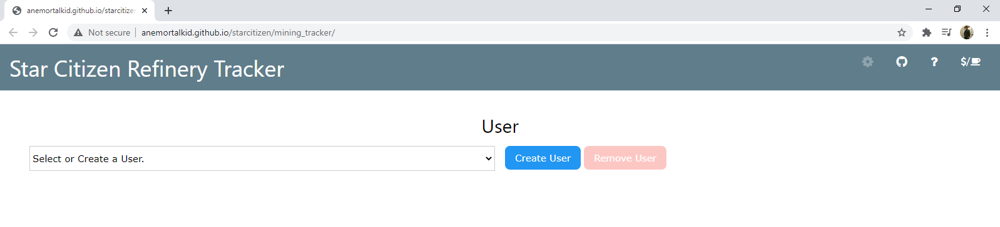
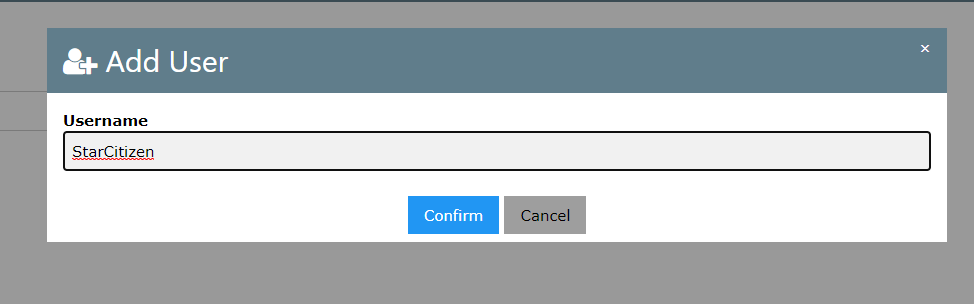
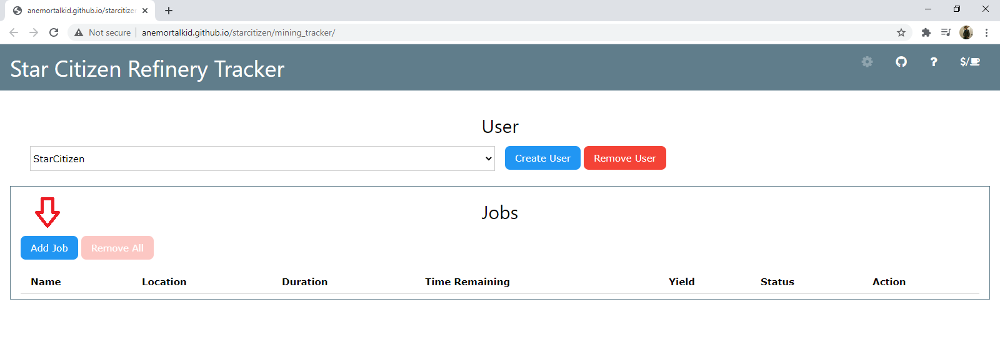
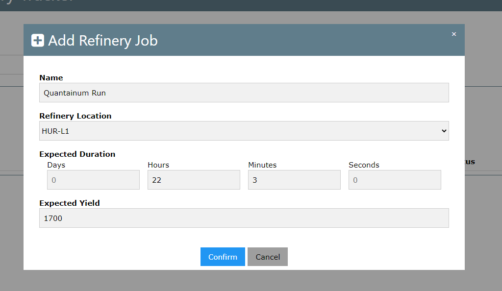
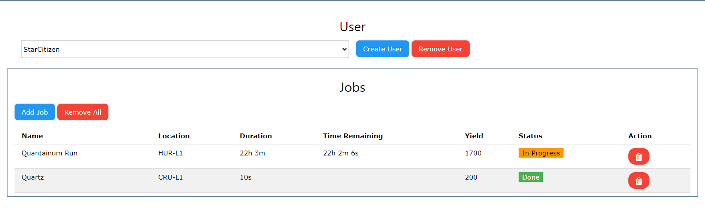
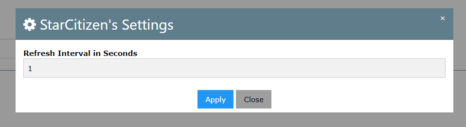

# sc-refinery-tracker Updated 2024

Updated a few Stations and added names + missing Iron as a rescource
all credits go to AnEmortalKid

[](https://travis-ci.com/AnEmortalKid/sc-refinery-tracker)

The Refinery Tracker keeps track of your refinery jobs in StarCitizen

See in action:

* LIVE Version: http://anemortalkid.github.io/starcitizen/mining_tracker/
* DEV Updates: https://anemortalkid.github.io/sc-refinery-tracker/


### Contributing
0. Fork this repository
1. Clone repository
``` 
git clone https://github.com/{GITHUB_USERNAME}/sc-refinery-tracker.git
```
2. Install dependencies 
``` 
cd sc-refinery-tracker
```
```
yarn install
```
3. Run dev server
```
yarn start:watch
```
4. Navigate to localhost:9000 and start making your changes
4. Open PR on main repo requesting merge of changes on your fork

## Data

* All data is kept locally on your browser through the usage of `localStorage` (for now)

## Usage

A set of refinery jobs is tracked by user (in the event that you have multiple users working on the same machine).

1. Start by creating a user (it can be any name, but I recommend using your username's handle)




2. Add a Refinery Job for your user by clicking the "Add Job" button



3. Fill out your job's details



4. Once your jobs are complete (or estimated to be complete, their status will be marked "Done")



By default, jobs update their Time Remaining every second. If you would like to change this value, change the Settings for the user.

### Settings

1. Use the COG icon after selecting a User
2. Modify the settings in the dialog



